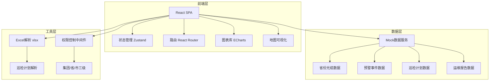
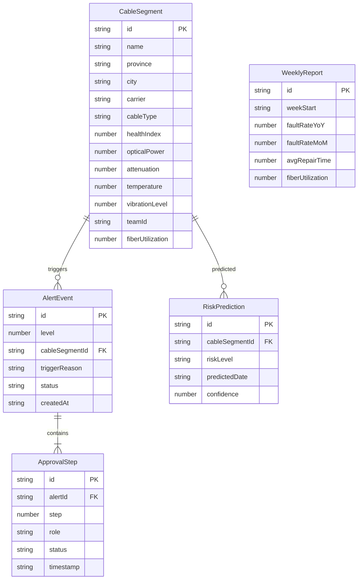

## 1. 架构设计



## 2. 技术说明

- **前端框架**：React@18 + TypeScript + Vite
- **样式方案**：Tailwind CSS@3 + CSS变量主题
- **状态管理**：Zustand
- **路由**：React Router DOM@6
- **图表库**：ECharts@5（通过echarts-for-react封装）
- **地图可视化**：ECharts中国地图组件（内建省份轮廓GeoJSON）
- **Excel解析**：xlsx（SheetJS）库
- **图标库**：lucide-react
- **后端**：无（使用Mock数据模拟）
- **数据库**：无（使用内存数据+localStorage持久化）

## 3. 路由定义

| 路由 | 用途 |
|------|------|
| / | 全国总览看板，展示健康热力图、故障排名、核心指标 |
| /province/:provinceId | 省份下钻页，展示地市光缆明细、趋势、故障分布 |
| /alerts | 预警中心，展示预警列表和审批流程 |
| /inspection | 巡检管理，上传巡检计划、风险预测、路线推荐 |
| /reports | 运维报告，周报列表和报告详情 |

## 4. API定义（Mock数据接口）

```typescript
interface CableSegment {
  id: string
  name: string
  province: string
  city: string
  carrier: '移动' | '联通' | '电信'
  cableType: '骨干' | '汇聚' | '接入'
  healthIndex: number
  opticalPower: number
  attenuation: number
  temperature: number
  vibrationLevel: number
  teamId: string
  teamName: string
  lastInspection: string
  fiberUtilization: number
}

interface AlertEvent {
  id: string
  level: 1 | 2
  cableSegmentId: string
  cableSegmentName: string
  province: string
  city: string
  triggerReason: string
  triggerData: { timestamp: string; value: number }[]
  status: 'pending' | 'processing' | 'escalated' | 'approved' | 'closed'
  createdAt: string
  deadline: string
  approvalFlow: ApprovalStep[]
}

interface ApprovalStep {
  step: number
  role: string
  approver: string
  status: 'pending' | 'approved' | 'rejected'
  timestamp?: string
  comment?: string
}

interface InspectionPlan {
  id: string
  fileName: string
  uploadDate: string
  segments: string[]
  riskPredictions: RiskPrediction[]
  recommendedRoutes: RecommendedRoute[]
  spliceSchemes: SpliceScheme[]
}

interface RiskPrediction {
  cableSegmentId: string
  cableSegmentName: string
  riskLevel: 'high' | 'medium' | 'low'
  riskFactors: string[]
  predictedDate: string
  confidence: number
}

interface RecommendedRoute {
  id: string
  segments: string[]
  totalDistance: number
  estimatedTime: string
  priorityScore: number
}

interface SpliceScheme {
  id: string
  splicePoint: string
  requiredMaterials: string[]
  estimatedTime: string
  fiberCount: number
}

interface WeeklyReport {
  id: string
  weekStart: string
  weekEnd: string
  faultRateYoY: number
  faultRateMoM: number
  avgRepairTime: number
  repairTimeRanking: { province: string; avgHours: number }[]
  fiberUtilization: number
  faultTypeDistribution: Record<string, number>
  recommendations: string[]
}

interface ProvinceHealthSummary {
  province: string
  avgHealthIndex: number
  totalCableKm: number
  faultRate: number
  avgRepairTime: number
  cityDetails: CityDetail[]
}

interface CityDetail {
  city: string
  healthIndex: number
  cableCount: number
  faultCount: number
  powerTrend: { date: string; value: number }[]
  faultTypeDistribution: Record<string, number>
}
```

## 5. 服务器架构图

不适用，本项目为纯前端应用，使用Mock数据。

## 6. 数据模型

### 6.1 数据模型定义



### 6.2 数据定义语言

本项目使用Mock数据，数据以TypeScript常量形式定义在 `src/mock/` 目录中，涵盖：
- 全国31个省份的光缆段数据（每省5-15个地市，每地市10-50个光缆段）
- 近30天的光功率时序数据
- 预警事件和审批流程数据
- 巡检计划和风险预测数据
- 周报历史数据
